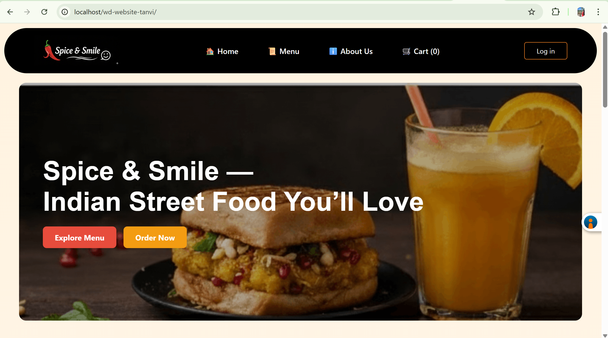
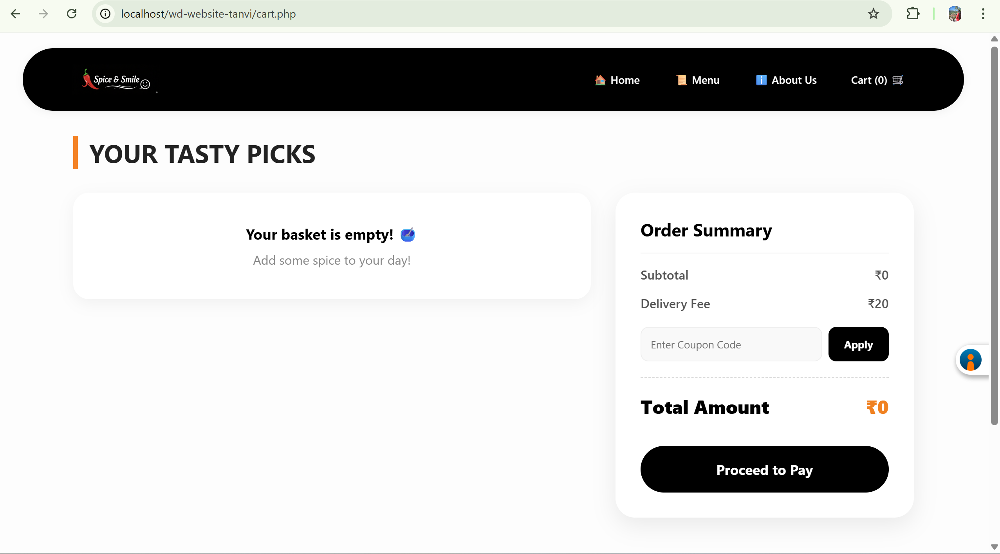
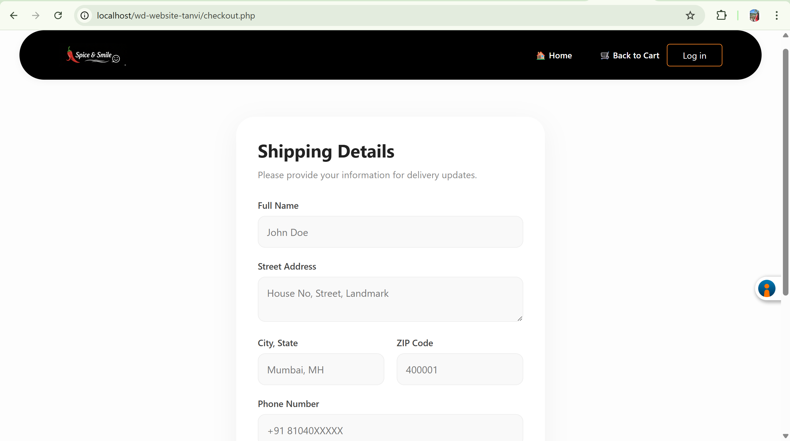
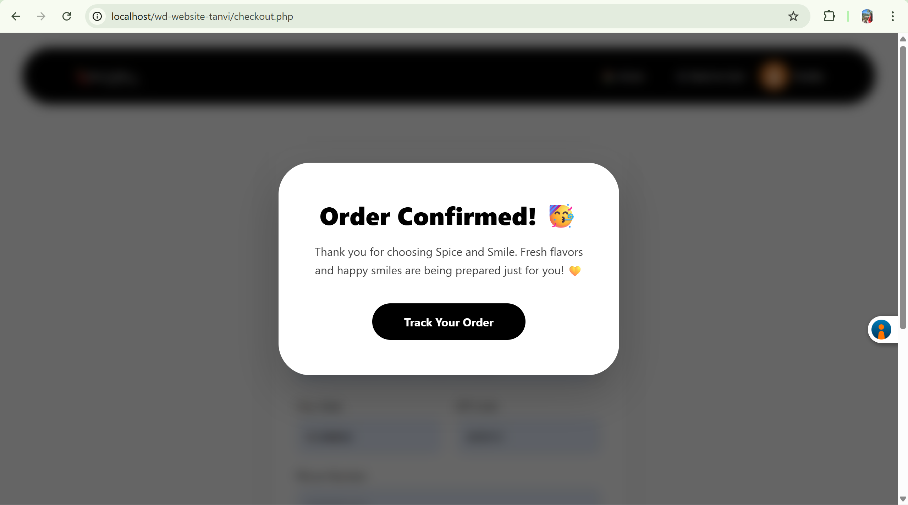

# 🍽️ Spice and Smile

> A modern, user-friendly web application for seamless food ordering, built with HTML, CSS , JavaScript, and MYSQL (WAMP).

---

## 🚀 Overview

Spice and Smile is a dynamic web-based food ordering platform that enables users to browse a diverse menu, add items to their cart, place orders, and track their order history. The project is designed for easy extensibility and a smooth user experience.

---

## ✨ Features

- Secure user registration and authentication
- Interactive menu browsing with images
- Shopping cart and streamlined checkout process
- Order history and tracking
- Rewards and loyalty system
- Responsive design for desktop and mobile

---

## 🛠️ Getting Started

### Prerequisites
- A local web server (WAMP, XAMPP, MAMP, etc.) with PHP and MySQL support

### Installation
1. Clone or download this repository.
2. Place the project folder in your web server's root directory (e.g., `c:/wamp64/www/`).
3. Import the database (if provided) using phpMyAdmin or the MySQL command line.
4. Start your local server.
5. Open `index.php` in your browser to access the homepage.

---

## 📁 Project Structure

```
├── aboutus.php / .js / .css
├── cart.php / .js / .css
├── checkout.php / .js / .css
├── db.php
├── home.js
├── HOMEPAGE.css
├── index.php
├── logout.php
├── menu.php / .js / .css
├── my_orders.php
├── process_otp.php
├── rewards.php
├── save_order.php
├── signup.php / .js / .css
├── verify_otp.php / verify_otp_process.php
├── images/
└── README.md
```

- **PHP files:** Backend logic and page rendering
- **JS files:** Frontend interactivity
- **CSS files:** Styling and layout
- **images/**: Project images and assets

---

---

## 📸 Screenshots

-🏠 Homepage


-🛒 Cart Page


-💳 Checkout Page


-📦 Order Confirmation



## 🙋‍♂️ Author

**Tanvi Ajit Sawant**  
[GitHub Profile](https://github.com/tanvisawant0417)

---

## 📄 License

This project is for educational purposes only. Feel free to use and modify for learning or personal projects.
